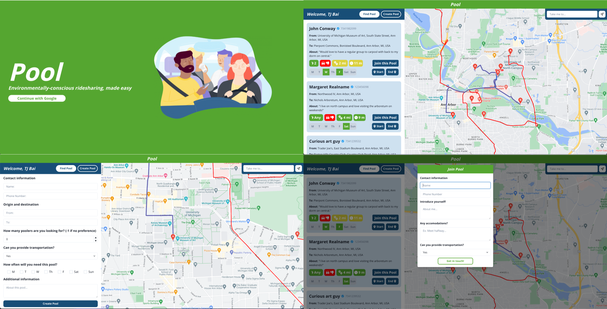

# Pool
A solo hackathon project developed for Simplihacks 2022 under the theme "environment." 

### About Pool
Pool is a one-stop solution for overworked professionals, broke college students, and everyone in between to find and create carpool groups while slashing their carbon footprint

__Watch this video!__ 

### Technologies
ReactJS, NextJS, Recoil, ChakraUI, Firebase, Google Maps API, Twilio API
